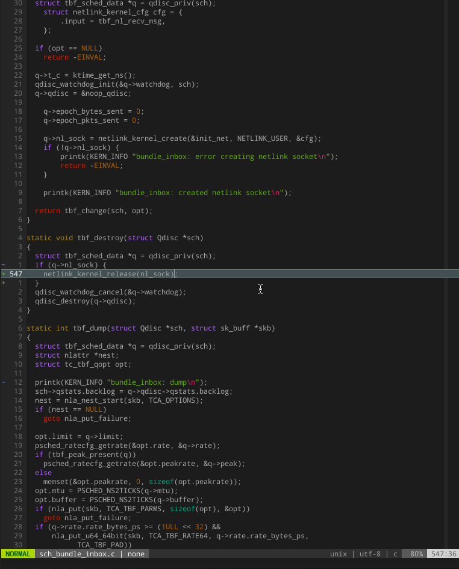

# bootlin.vim

A simple plugin for easily searching and viewing Linux source code via Elixir's Bootlin from directly within vim.

### Install

vim-plug (recommended):
* Add `Plug 'fcangialosi/bootlin.vim'` to your ~/.vimrc
* Run `:PlugInstall`

vundle:
* Add `Plugin 'fcangialosi/bootlin.vim'` to your ~/.vimrc
* Run `:PluginInstall`

manual:
* git clone this repository into your `.vim/` plugins directory
a

### Usage

1. In normal mode, type `:Lxs` to start searching
2. Input an identifier to search for and press enter. This will open a new split at the bottom listing all the places the identifier was found.
3. Move your cursor over the one you're interested in and press enter. This will open a new split above with the source code for that file at the correct line number. By default it is opened in a scratch buffer, so if you want to save it you'll need to do so manually. 
4. Navigate back to the identifier listing at any time and hit enter to open any of the other source files

### TODOs

Things I'd like to do eventually:
* Make it asynchronous
* Handle the case where an identifier appears multiple times in a file
* Make it more easily configurable (height of splits, etc.)

